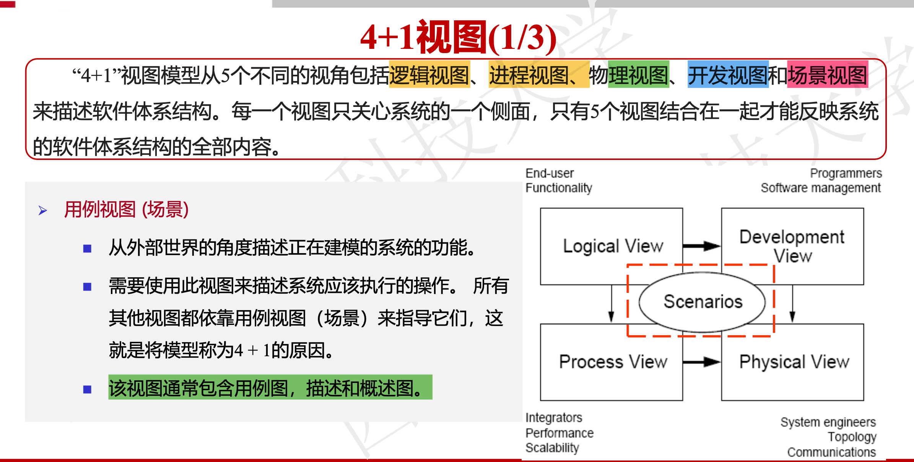
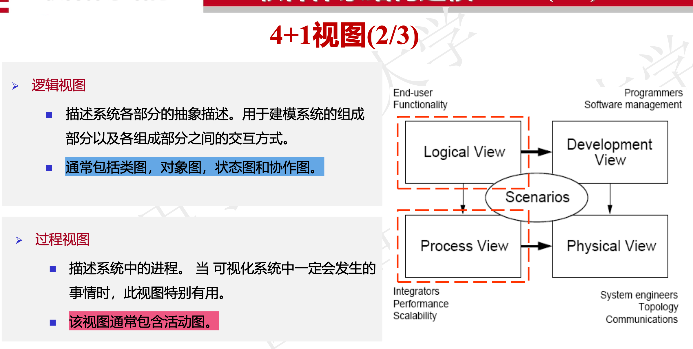
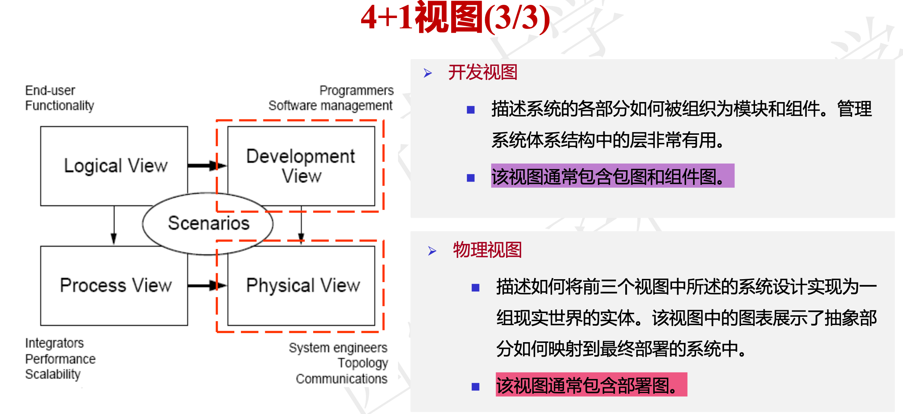

# 统一建模语言（UML, Unified Modeling Language）图表分类与特点

## 概述
UML通过多种图表从不同视角描述软件系统，分为**结构图（Structure Diagrams）​**、**行为图（Behavior Diagrams）​**和**交互图（Interaction Diagrams）​**三大类。

---

## 一、结构图（Structure Diagrams）
描述系统在特定时间点的静态结构。

| 图表类型 | 特点 | 用途 | 对应4+1视图 |
|----------|------|------|-------------|
| ​**类图（Class Diagram）​**​ | 表示类及其关系（关联、继承等） | 描述系统静态结构 | 逻辑视图（Logical View） |
| ​**对象图（Object Diagram）​**​ | 显示类的实例在特定时刻的快照 | 展示类图的运行时实例化情况 | 逻辑视图 |
| ​**构件图（Component Diagram）​**​ | 描述代码构件的物理结构和依赖关系 | 基于组件的开发（CBD, Component-Based Development） | 开发视图（Development View） |
| ​**部署图（Deployment Diagram）​**​ | 定义软硬件物理架构 | 描述系统部署配置 | 物理视图（Physical View） |
| ​**包图（Package Diagram）​**​ | 将模型元素分组到高级单元 | 组织相关元素 | 开发视图 |
| ​**复合结构图（Composite Structure Diagram）​**​ | 分层分解类的内部结构 | 显示复杂对象的运行时分解 | 逻辑视图 |

---

## 二、行为图（Behavior Diagrams）
描述系统的动态行为。

| 图表类型 | 特点 | 用途 | 对应4+1视图 |
|----------|------|------|-------------|
| ​**用例图（Use Case Diagram）​**​ | 从外部视角描述系统功能 | 定义需求 | 场景视图（Scenario View） |
| ​**活动图（Activity Diagram）​**​ | 描述活动流程和并行行为 | 工作流建模 | 过程视图（Process View） |
| ​**状态图（State Diagram）​**​ | 描述对象状态变化 | 适合UI/控制对象 | 逻辑视图 |

---

## 三、交互图（Interaction Diagrams）
行为图的子类，专用于对象间协作。

| 图表类型 | 特点 | 对比优势 |
|----------|------|----------|
| ​**序列图（Sequence Diagram）​**​ | 按时间顺序显示对象交互 | 适合单个用例分析 |
| ​**通信图（Communication Diagram）​**​ | 显示对象组织结构及消息传递 | 便于白板修改 |
| ​**交互概览图（Interaction Overview Diagram）​**​ | 结合活动图和序列图 | 适合简单场景 |
| ​**时序图（Timing Diagram）​**​ | 描述状态变化的时序约束 | 精确显示时间线 |

---

## 四、4+1视图模型（4+1 View Model）

| 视图类型 | 主要图表 |
|----------|----------|
| ​**逻辑视图（Logical View）​**​ | 类图、状态图 |
| ​**过程视图（Process View）​**​ | 活动图 |
| ​**物理视图（Physical View）​**​ | 部署图 |
| ​**开发视图（Development View）​**​ | 包图、构件图 |
| ​**场景视图（Scenario View）​**​ | 用例图 |

> ​**核心原则**​：用例视图（Use Case View）驱动其他视图设计。

