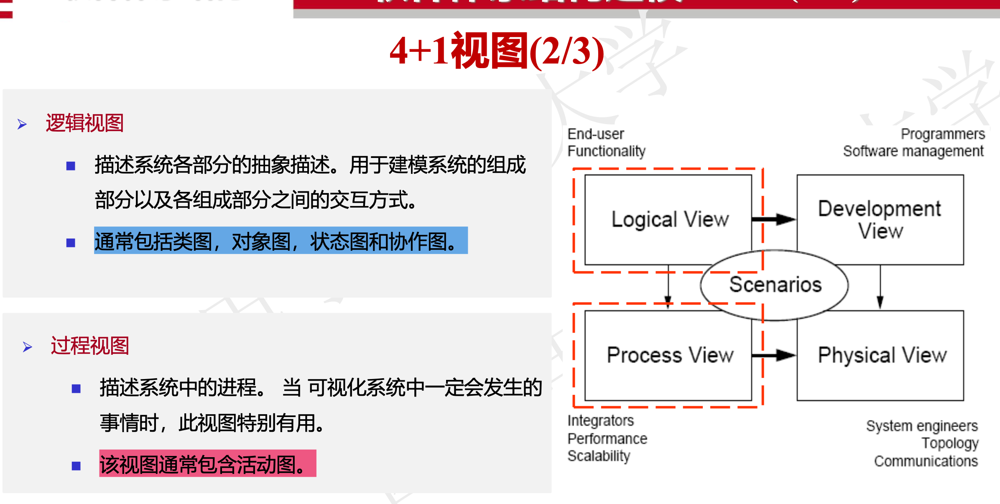
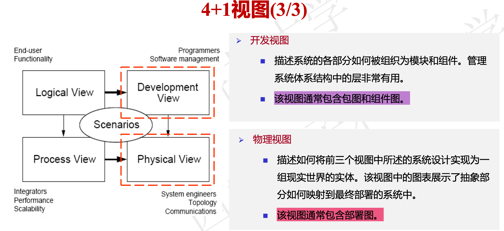

# 软件体系结构风格超级精简版

## 一、数据流体系结构风格 (Data Flow Style)

### 概述
数据流体系结构风格强调数据到达时即被激活，无数据则不工作。构件通过数据流动实现交互连接。

### 组成要素
- ​**构件**​：数据处理构件 (Data Processing Components)
- ​**连接件**​：数据流 (Data Flow)

### 特征
1. 数据的可用性决定处理是否执行
2. 任何有输入的组件都可以处理它
3. 整体数据转换是各个转换的"功能组合"
4. 系统结构由数据在各处理之间的有序移动决定
5. 在纯数据流系统中，处理之间除了数据交换没有其他交互
6. 数据可以以自由模式流动
7. 多向复杂的数据流容易形成死锁

### 1.1 批处理体系结构风格 (Batch Sequential Style)

#### 特点
- 多个独立计算单元
- 数据完整传输后才进行下一阶段处理

#### 组成要素
- ​**构件**​：独立的应用程序构件
- ​**连接件**​：数据流图

#### 约束
1. 每个处理步骤是独立程序
2. 前一步结束才能开始下一步
3. 数据作为整体传输
4. 构件必须是独立实体
5. 构件无需了解数据流源头与去处

#### 优缺点
| 优点 | 缺点 |
|------|------|
| 高内聚低耦合 | 不支持并行执行 |
| 功能模块复用 | 交互能力弱 |
| 易于维护扩展 | 数据传输缺乏标准 |
| 支持吞吐量分析 | 需处理同步问题 |

​**应用实例**​：Eclipse代码重复检测工具

### 1.2 管道-过滤器体系结构风格 (Pipe and Filter Style)

#### 特点
- 数据通过管道在不同过滤器间传输处理

#### 组成要素
- ​**构件**​：过滤器 (Filter)
- ​**连接件**​：管道 (Pipe)

#### 过滤器功能
1. 合并
2. 分解
3. 增加/丰富
4. 删减/浓缩
5. 转换

#### 优缺点
| 优点 | 缺点 |
|------|------|
| 高内聚低耦合 | 交互性差 |
| 功能模块复用 | 性能不高 |
| 支持并行执行 | 格式转换耗时 |

​**应用实例**​：自来水处理系统、车牌识别系统

## 二、调用/返回体系结构风格 (Call/Return Style)

### 概述
基于消息传递的架构，通过相互调用和返回来协同工作。

### 特点
1. 显式调用
2. 局部作用域
3. 同步执行
4. 明确的结果返回

### 2.1 主程序-子过程体系结构风格 (Main Program/Subroutine Style)

#### 特点
- 单线程控制
- 分层设计思想

#### 组成要素
- ​**构件**​：主程序和子程序
- ​**连接件**​：调用-返回机制

#### 优缺点
| 优点 | 缺点 |
|------|------|
| 降低问题复杂性 | 只适用于步骤化问题 |
| 单线程控制 | 子系统结构不清晰 |

​**应用实例**​：在线购物系统

### 2.2 面向对象体系结构风格 (Object-Oriented Style)

#### 特点
- 以对象为基础
- 提高模块化程度

#### 组成要素
- ​**构件**​：类和对象
- ​**连接件**​：过程调用、消息传递

#### 约束
1. 封装性
2. 继承性

#### 优缺点
| 优点 | 缺点 |
|------|------|
| 模拟现实世界 | 对象数量庞大 |
| 黑箱操作 | 单一接口能力有限 |
| 便于复用维护 | 业务对象关系复杂 |

​**应用实例**​：在线商城系统

### 2.3 层次系统体系结构风格 (Layered System Style)

#### 特点
- 分层设计
- 每层负责特定功能

#### 组成要素
- ​**构件**​：层次构件
- ​**连接件**​：层间交互协议

#### 约束
1. 各层级相互独立
2. 服务单向依赖

#### 优缺点
| 优点 | 缺点 |
|------|------|
| 降低复杂度 | 上层需知下层身份 |
| 修改影响小 | 数据开销大 |
| 支持复用 |  |

​**应用实例**​：计算机网络协议栈

## 三、以数据为中心体系结构风格 (Data-centered Style)

### 概述
通过中央数据结构实现数据共享。

### 发展趋势
文件存储 → 共享内存 → 数据库

### 优缺点
| 优点 | 缺点 |
|------|------|
| 操作方便 | 同步问题 |
| 耦合度低 | 中央结构压力大 |
| 数据生产消费灵活 | 性能瓶颈 |

### 3.1 仓库体系结构风格 (Repository Style)

#### 特点
- 数据处理应用抽象层

#### 优缺点
| 优点 | 缺点 |
|------|------|
| 逻辑清晰 | 灵活性差 |
| 数据一致性强 | 单点故障 |

​**应用实例**​：数据库系统

### 3.2 黑板体系结构风格 (Blackboard Style)

#### 组成要素
1. 黑板 (Blackboard)
2. 知识源 (Knowledge Source)
3. 控制器 (Control Component)

#### 工作过程
1. 问题分解
2. 领域知识分析
3. 子问题表达设计
4. 子问题求解

#### 优缺点
| 优点 | 缺点 |
|------|------|
| 处理复杂问题 | 结构变化影响大 |
| 可修改性高 | 可能存在无解 |
| 知识源可重用 | 终止条件难定 |

​**应用实例**​：视频流人体检测系统

## 四、虚拟机体系结构风格 (Virtual Machine Style)

### 概述
构建上层虚拟机，增加环境适应能力。

### 优缺点
| 优点 | 缺点 |
|------|------|
| 资源利用率高 | 性能开销 |
| 硬件隔离安全 | 通信限制 |
| 快速部署 | 硬件限制 |

### 4.1 解释器体系结构风格 (Interpreter Style)

#### 组成要素
- 解释器引擎
- 三个存储区：
  1. 被解释的程序
  2. 程序状态
  3. 引擎状态

#### 优缺点
| 优点 | 缺点 |
|------|------|
| 灵活性高 | 执行效率低 |
| 跨平台性 | 调试困难 |

​**应用实例**​：Office快捷键解释

### 4.2 规则系统体系结构风格 (Rule-Based System Style)

#### 组成要素
1. 工作内存
2. 规则解释器
3. 知识库

#### 优缺点
| 优点 | 缺点 |
|------|------|
| 规则可重用 | 系统复杂 |
| 管理难度低 | 性能问题 |

​**应用实例**​：金融规则引擎

## 五、独立构件体系结构风格 (Independent Components Style)

### 特点
- 构件相对独立
- 通过消息/事件通信

### 5.1 进程通信体系结构风格 (Process Communication Style)

#### 特点
- 独立进程
- 消息通信

#### 变种
1. 通信网络拓扑
2. 同步/异步需求
3. 消息接收方数量

### 5.1.1 多Agent体系结构风格 (Multi-Agent System Style)

#### 特点
- Agent自主决策
- 通过合作实现目标

#### 优点
1. 可重用性强
2. 适应异构环境

​**应用实例**​：无人机集群系统

### 5.2 事件系统体系结构风格 (Event-Driven System Style)

#### 特点
1. 分离的交互
2. 构件独立
3. 一对多通信
4. 基于事件触发
5. 异步操作

#### 事件派遣机制
1. 无独立派遣模块
2. 有独立派遣模块：
   - 点对点模式
   - 发布-订阅模式

​**应用实例**​：股票交易平台

## 六、新兴体系结构风格

### 6.1 云原生体系结构风格 (Cloud-Native Architecture Style)

#### 核心目标
1. 可用性
2. 规模
3. 敏捷
4. 成本

#### 资源层
1. 容器 (Container)
   - 镜像 (Image)
   - 仓库 (Repository)
2. 不可变基础设施

#### 平台层
1. 服务网格 (Service Mesh)
2. Kubernetes (K8S)

#### 应用层
1. 微服务 (Microservices)
2. CI/CD

​**应用实例**​：申通快递系统

### 6.2 大数据处理体系结构风格 (Big Data Processing Architecture Style)

#### 核心组件
1. 数据源
2. 数据集成
3. 数据存储
4. 数据分析
5. 分析报告

### 6.2.1 Lambda体系结构风格

#### 组成
1. 批处理层 (Batch Layer)
2. 加速层 (Speed Layer)
3. 服务层 (Serving Layer)

#### 优缺点
| 优点 | 缺点 |
|------|------|
| 批流统一 | 系统复杂 |
| 高吞吐量 | 维护成本高 |

​**应用实例**​：SmartNews

### 6.2.2 Kappa体系结构风格

#### 特点
- 单一数据流
- 流式处理为主

#### 优缺点
| 优点 | 缺点 |
|------|------|
| 结构简单 | 不支持批处理 |
| 实时性高 | 存储成本高 |

### 6.2.3 IOTA体系结构风格

#### 特点
- 分布式场景
- 边缘计算

#### 优缺点
| 优点 | 缺点 |
|------|------|
| 无交易费 | 技术复杂 |
| 实时处理 | 延迟依赖网络 |

​**应用实例**​：区块链系统

## 软件质量属性与架构风格关系

### 概述
质量属性是非功能性需求，影响：
1. 运行时行为
2. 系统设计
3. 用户体验

### 质量属性场景要素
1. 刺激源
2. 刺激
3. 制品
4. 环境
5. 响应
6. 响应衡量指标

明白了，我会在原文基础上，仅为重点词语添加英文对照，保持原有格式不变。

# 质量属性 (Quality Attributes) 与策略 (Tactics) 详解

## 概述
质量属性 (Quality Attributes, QA) 是指可用性、性能、安全性等可度量、可测试的属性，属于非功能性需求 (Non-functional Requirements)，会影响系统的运行时行为、系统设计方式以及用户的体验等。

策略 (Tactics) 是满足特定质量属性的具体措施，是软件体系结构 (Software Architecture) 中体系结构风格 (Architectural Style) 的基本单元，不同的体系结构风格包含不同的策略集合，以实现相应的质量属性。

## 1. 可用性 (Availability)

### 定义
软件在特定环境下持续正常运行的能力，即系统能够正常运行的时间比例。它关注系统是否发生了故障以及故障的后果。

### 场景组成
- **刺激源 (Source of Stimulus)**：故障的迹象（来自内部或外部）
- **刺激 (Stimulus)**：系统出错、系统崩溃、给出结果不准时、给出错误结果
- **制品 (Artifact)**：计算、存储、网络传输（系统被影响的部分）
- **环境 (Environment)**：正常状态或"亚健康"状态
- **响应 (Response)**：
  - 记录日志 (Logging)（错误报告）
  - 回传给厂家
  - 通知管理员或其他系统
  - 关闭系统
- **响应衡量指标 (Response Measure)**：
  - 故障时间百分比
  - 修复故障所需时间
  - 平均无故障时间

### 实现策略

#### 1. 故障检测 (Fault Detection)
- **监控探测 (Ping/Echo)**：监控组件不定期向被监控组件发送ping消息
- **心跳 (Heartbeat)**：被监控组件定期发送心跳信号
- **异常 (Exceptions)**：通过编程语言支持处理异常

#### 2. 故障恢复 (Fault Recovery)
- **投票 (Voting)**：通过冗余组件投票机制选取正确结果
- **主动冗余 (Active Redundancy) 和 被动冗余 (Passive Redundancy)**：确保备用系统及时接管
- **备件 (Spare)**：预留备用组件
- **影子操作 (Shadow Operation)**：运行多个副本，一个用于实际请求，其他作为"影子"模式运行
- **状态再同步 (State Resynchronization)**：使系统状态重新达到一致
- **检查点/回滚 (Checkpoint/Rollback)**：定期保存系统状态

> 解释：Shadow操作类似于A/B测试，但主要用于系统可靠性验证，而不是功能测试。

#### 3. 故障避免 (Fault Prevention)
- **服务下线 (Service Removal)**：主动下线以避免故障
- **事务 (Transaction)**：确保操作的原子性
- **进程监控 (Process Monitor)**：监控系统健康状况

## 2. 可修改性 (Modifiability)

### 定义
指软件系统在未来能够容易地进行修改的能力，以适应需求和环境变更。

### 场景组成
- **刺激源 (Source of Stimulus)**：开发人员、管理员、用户等
- **刺激 (Stimulus)**：改变项
- **制品 (Artifact)**：被改变的部分
- **环境 (Environment)**：系统可被修改的状态
- **响应 (Response)**：修改者理解并完成修改和部署
- **响应衡量指标 (Response Measure)**：
  - 修改完成时间
  - 人力/经济成本
  - 受影响元素数量

### 实现策略

#### 1. 限制修改范围 (Limit Modification Scope)
- **模块高内聚低耦合 (High Cohesion Low Coupling)**
- **使用通用化模块 (Generic Modules)**
- **隐藏信息 (Information Hiding)**
- **维持接口不变 (Interface Stability)**
- **限制通信路径 (Communication Path Limitation)**
- **使用中介 (Mediator)**
- **命名服务 (Naming Service)**

#### 2. 延迟绑定时间 (Defer Binding Time)
- **配置文件 (Configuration Files)**
- **发布/订阅模式 (Publish/Subscribe Pattern)**
- **多态 (Polymorphism)**
- **组件更换 (Component Replacement)**
- **遵守已定义的协议 (Protocol Adherence)**

> 解释：延迟绑定时间策略允许系统在运行时动态改变行为，而不需要重新编译或部署。

## 3. 性能 (Performance)

### 定义
指软件系统在给定条件下执行任务或提供服务时所展现的效率或速度，关注系统对事件的响应速度。

### 场景组成
- **刺激源 (Source of Stimulus)**：系统内部或外部（用户请求、并发用户数、数据量增加、定时事件）
- **刺激 (Stimulus)**：事件的产生（周期性、随机性、偶然性）
- **制品 (Artifact)**：系统服务
- **环境 (Environment)**：正常状态、紧急状态、过载状态等
- **响应 (Response)**：系统对事件的处理
- **响应衡量指标 (Response Measure)**：
  - 响应时间
  - 吞吐量 (Throughput)
  - 并发用户数量
  - 失败率
  - 处理时长

### 实现策略

#### 1. 优化资源需求 (Resource Demand Optimization)
- **提高计算效率 (Computational Efficiency)**：优化算法和代码实现
- **减少要处理的数据总量 (Data Volume Reduction)**：数据过滤、压缩
- **限制执行时间 (Execution Time Limitation)**
- **限制待处理事件队列长度 (Queue Size Limitation)**

> 解释：就像地铁限流一样，系统也需要根据自身承载能力来限制并发请求数量。

#### 2. 优化资源管理 (Resource Management Optimization)
- **引入并发机制 (Concurrency)**
- **增加可用资源 (Resource Increase)**：增加硬件资源、带宽等
- **维持数据或计算的多个副本 (Multiple Copies)**：使用缓存

#### 3. 优化资源仲裁 (Resource Arbitration)
- **先来先服务 (First-Come-First-Served, FCFS)**
- **固定优先级调度 (Fixed Priority Scheduling)**
- **动态优先级调度 (Dynamic Priority Scheduling)**
- **静态调度 (Static Scheduling)**

## 4. 安全性 (Security)

### 定义
软件在受到恶意攻击的情况下仍能继续正确运行，并确保软件在授权范围内被合法使用的能力。

### 场景组成
- **刺激源 (Source of Stimulus)**：外部攻击者/内部员工
- **刺激 (Stimulus)**：任何对系统造成威胁的行为
- **制品 (Artifact)**：系统对外提供的服务/数据
- **环境 (Environment)**：联网或未联网、在线或离线、在防火墙内或外
- **响应衡量指标 (Response Measure)**：
  - 发起攻击的难度
  - 从攻击中恢复的难度
  - 攻击检测概率
  - 服务可用性百分比

### 实现策略

#### 1. 抵抗攻击 (Attack Resistance)
- **验证用户身份 (Authentication)**：账号密码+验证码
- **验证用户权限 (Authorization)**：角色权限管理
- **维持数据保密性 (Data Confidentiality)**：如HTTPS加密
- **维持数据完整性 (Data Integrity)**：如校验码验证
- **减少暴露 (Exposure Reduction)**：关闭不必要端口
- **限制访问 (Access Restriction)**：防火墙配置

#### 2. 检测攻击 (Attack Detection)
- **安全日志 (Security Logging)**：记录操作和IP地址
- **异常行为监测 (Anomaly Detection)**：使用机器学习等技术

#### 3. 从攻击中恢复 (Attack Recovery)
- **恢复状态 (State Recovery)**：使用缓存恢复
- **识别攻击者 (Attacker Identification)**

## 5. 可测试性 (Testability)

### 定义
软件被测试的难易程度，即通过测试发现并证明错误的轻松程度。

### 场景组成
- **刺激源 (Source of Stimulus)**：各类测试人员、开发者
- **刺激 (Stimulus)**：开发里程碑完成、正常/异常输入
- **制品 (Artifact)**：系统模块、组件或整体
- **环境 (Environment)**：各个开发阶段
- **响应衡量指标 (Response Measure)**：
  - 功能正确性指标
  - 测试覆盖率 (Test Coverage)
  - 未来发现bug概率
  - 测试时间

### 实现策略

#### 1. 黑盒测试 (Black-box Testing)
- **录制/回放 (Record/Playback)**：记录用户操作序列
- **分离接口和实现 (Interface-Implementation Separation)**：便于跨平台测试
- **提供专用测试路径 (Dedicated Test Path)**：如安卓的"开发者选项"

#### 2. 白盒测试 (White-box Testing)
- **使用IDE内置调试工具 (IDE Debugging Tools)**：断点、单步执行等
- **使用外部工具 (External Testing Tools)**：专门的测试工具

## 6. 易用性 (Usability)

### 定义
用户能够方便地使用软件系统的程度。

### 场景组成
- **刺激源 (Source of Stimulus)**：用户操作、系统事件
- **刺激 (Stimulus)**：各类用户操作和需求
- **响应衡量指标 (Response Measure)**：
  - 任务完成时间
  - 错误次数
  - 用户满意度
  - 操作成功率

### 实现策略

#### 1. 运行时策略 (Runtime Tactics)
- **猜测任务 (Task Prediction)**：预测用户意图
- **适当反馈 (Appropriate Feedback)**：及时提供提示
- **一致体验 (Consistent Experience)**：PC端和移动端保持一致
- **支持撤销 (Support Undo)**：允许操作回退
- **操作引导 (Operation Guide)**：提供清晰指南
- **简化操作 (Operation Simplification)**：减少操作步骤

#### 2. 设计时策略 (Design-time Tactics)
- **用户界面独立 (UI Independence)**：提供多种主题
- **MVC模式 (Model-View-Controller)**：分离数据、表示和控制
- **PAC模式 (Presentation-Abstraction-Control)**：强调分层抽象
- **用户界面架构 (UI Architecture)**：Seeheim和Arch/Slinky

> 解释：这些架构模式（MVC、PAC等）不仅提高了系统的可维护性，也能让用户界面更容易适应不同的使用场景和用户需求。

# 统一建模语言（UML, Unified Modeling Language）图表分类与特点

## 概述
UML通过多种图表从不同视角描述软件系统，分为**结构图（Structure Diagrams）​**、**行为图（Behavior Diagrams）​**和**交互图（Interaction Diagrams）​**三大类。

---

## 一、结构图（Structure Diagrams）
描述系统在特定时间点的静态结构。

| 图表类型 | 特点 | 用途 | 对应4+1视图 |
|----------|------|------|-------------|
| ​**类图（Class Diagram）​**​ | 表示类及其关系（关联、继承等） | 描述系统静态结构 | 逻辑视图（Logical View） |
| ​**对象图（Object Diagram）​**​ | 显示类的实例在特定时刻的快照 | 展示类图的运行时实例化情况 | 逻辑视图 |
| ​**构件图（Component Diagram）​**​ | 描述代码构件的物理结构和依赖关系 | 基于组件的开发（CBD, Component-Based Development） | 开发视图（Development View） |
| ​**部署图（Deployment Diagram）​**​ | 定义软硬件物理架构 | 描述系统部署配置 | 物理视图（Physical View） |
| ​**包图（Package Diagram）​**​ | 将模型元素分组到高级单元 | 组织相关元素 | 开发视图 |
| ​**复合结构图（Composite Structure Diagram）​**​ | 分层分解类的内部结构 | 显示复杂对象的运行时分解 | 逻辑视图 |

---

## 二、行为图（Behavior Diagrams）
描述系统的动态行为。

| 图表类型 | 特点 | 用途 | 对应4+1视图 |
|----------|------|------|-------------|
| ​**用例图（Use Case Diagram）​**​ | 从外部视角描述系统功能 | 定义需求 | 场景视图（Scenario View） |
| ​**活动图（Activity Diagram）​**​ | 描述活动流程和并行行为 | 工作流建模 | 过程视图（Process View） |
| ​**状态图（State Diagram）​**​ | 描述对象状态变化 | 适合UI/控制对象 | 逻辑视图 |

---

## 三、交互图（Interaction Diagrams）
行为图的子类，专用于对象间协作。

| 图表类型 | 特点 | 对比优势 |
|----------|------|----------|
| ​**序列图（Sequence Diagram）​**​ | 按时间顺序显示对象交互 | 适合单个用例分析 |
| ​**通信图（Communication Diagram）​**​ | 显示对象组织结构及消息传递 | 便于白板修改 |
| ​**交互概览图（Interaction Overview Diagram）​**​ | 结合活动图和序列图 | 适合简单场景 |
| ​**时序图（Timing Diagram）​**​ | 描述状态变化的时序约束 | 精确显示时间线 |

---

## 四、4+1视图模型（4+1 View Model）

| 视图类型 | 主要图表 |
|----------|----------|
| ​**逻辑视图（Logical View）​**​ | 类图、状态图 |
| ​**过程视图（Process View）​**​ | 活动图 |
| ​**物理视图（Physical View）​**​ | 部署图 |
| ​**开发视图（Development View）​**​ | 包图、构件图 |
| ​**场景视图（Scenario View）​**​ | 用例图 |

> ​**核心原则**​：用例视图（Use Case View）驱动其他视图设计。

